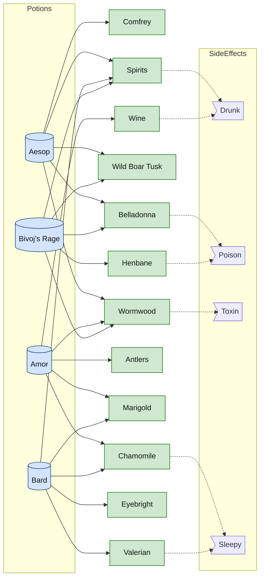

```mermaid
graph LR
  %%classDef potion fill:#d4e4ff,stroke:#036,stroke-width:1px;
  %%classDef herb   fill:#e6ffe6,stroke:#060,stroke-width:1px,font-size:10px;
  classDef potion fill:#d4e4ff,stroke:#036,stroke-width:1px,color:#111;
  classDef herb   fill:#cfe8cf,stroke:#060,stroke-width:1px,color:#111;
  classDef hub    fill:#ffffff,stroke:#999,stroke-dasharray:3 3,color:#111;
  classDef effect fill:#ffd6d6,stroke:#800,stroke-width:1px,color:#000,font-style:italic;

  %% Nó-poções
  subgraph Potions
    Aesop[("Aesop")]:::potion
    Amor[("Amor")]:::potion
    Bard[("Bard")]:::potion
    Bivos_rage[("Bivoj’s Rage")]:::potion
  end

  %% Nó-ingredientes (aparecem em várias poções)
  Comfrey["Comfrey"]:::herb
  Spirits["Spirits"]:::herb
  Belladonna["Belladonna"]:::herb
  Wild_tusk["Wild Boar Tusk"]:::herb
  Wormwood["Wormwood"]:::herb
  Chamomile["Chamomile"]:::herb
  Wine["Wine"]:::herb
  Antlers["Antlers"]:::herb
  Marigold["Marigold"]:::herb

  %% Aesop
  Aesop --> Comfrey
  Aesop --> Spirits
  Aesop --> Belladonna
  Aesop --> Wild_tusk
  Aesop --> Wormwood

  %% Amor
  Amor --> Wine
  Amor --> Antlers
  Amor --> Chamomile
  Amor --> Marigold
  Amor --> Wormwood

  %% Bard
  Bard --> Spirits
  Bard --> Valerian["Valerian"]:::herb
  Bard --> Chamomile
  Bard --> Eyewort["Eyebright"]:::herb
  Bard --> Marigold

  %% Bivoj’s Rage
  Bivos_rage --> Spirits
  Bivos_rage --> Henbane["Henbane"]:::herb
  Bivos_rage --> Belladonna
  Bivos_rage --> Wormwood
  Bivos_rage --> Wild_tusk


  subgraph SideEffects
    Drunk>Drunk]:::sideEffect
    Poison>Poison]:::sideEffect
    Toxin>Toxin]:::sideEffect
    Sleepy>Sleepy]:::sideEffect
  end

  %% ligações ingrediente → efeito adverso (tracejado)
  %%subgraph 
    Spirits -.-> Drunk>Drunk]
    Belladonna -.-> Poison>Poison]
    Henbane -.-> Poison>Poison]
    Wormwood -.-> Toxin>Toxin]
    Chamomile -.-> Sleepy>Sleepy]
    Valerian -.-> Sleepy>Sleepy]
    Wine -.-> Drunk>Drunk]
  %%end
```