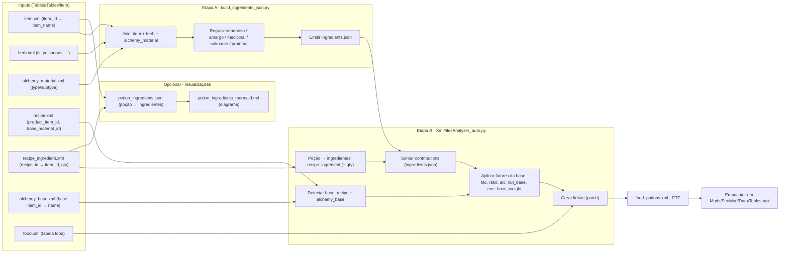

## Pipeline – Realistic Potions (KCD)

---

## Passo-a-passo (resumo)

Entradas (XML vanilla)

item.xml: nomes legíveis de cada item_id.

herb.xml: flags e metadados (ex.: is_poisonous).

alchemy_material.xml: classifica partes animais etc.

recipe.xml: liga poção → base_material_id (e product_item_id).

alchemy_base.xml: traduz base_material_id → Spirits/Wine/Water/Oil.

recipe_ingredient.xml: lista ingredientes (e quantidades) de cada receita.

food.xml: é a tabela que receberá o patch (PTF).

Etapa A — build_ingredients_json.py

Faz join de item.xml + herb.xml (+ alchemy_material.xml).

Aplica regras realistas (veneno forte/leves, amargo, medicinal, calmante, proteína).

Emite ingredients.json com:

name (facilita revisar),

nutrition, energy, health,

opcionais: absorption (ratio do ingrediente), element (aqua/ignis…).

Etapa B — XmlFilesAnalyzer_auto.py

Descobre a base de cada poção via recipe.xml + alchemy_base.xml.

Junta os ingredientes (e quantidades) via recipe_ingredient.xml.

Marca venenos via herb.xml.

Soma contribuições do ingredients.json e aplica fatores da base:

fac (diluição), ratio (short-term), alc, nut_base, ene_base, weight.

Gera food_potions.xml (PTF minimalista, só as linhas <row> alteradas).

Saída

food_potions.xml → empacotar em Mods\<SeuMod>\Data\Tables.pak e testar.

(Opcional) Visualização

potion_ingredients.json + potion_ingredients_mermaid.md para inspecionar rapidamente poções e dependências.

Comandos (relembrando)

# Regerar contribuições (se quiser atualizar regras)
python build_ingredients_json.py

# Gerar o patch PTF
python XmlFilesAnalyzer_auto.py
